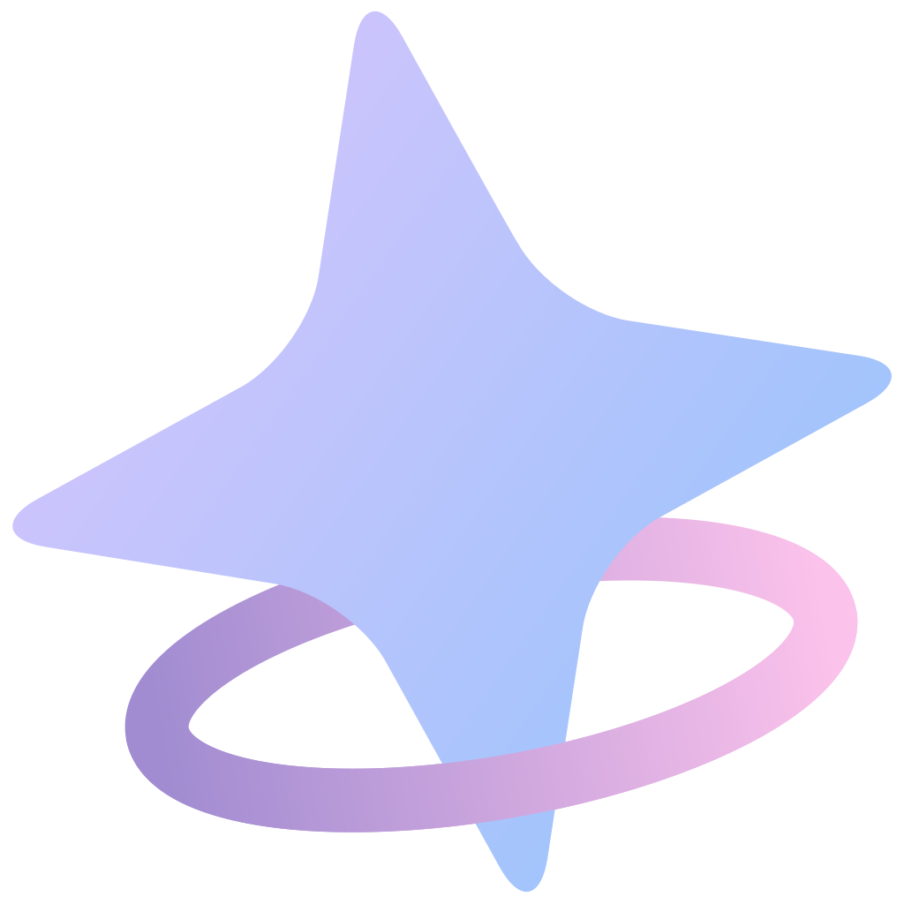

# dreamandroid 

**Android Stable Diffusion with Snapdragon NPU acceleration**  
_Also supports CPU/GPU inference_

## About this Repo

This project is **now open sourced and completely free**. Hope you enjoy it!

If you like it, please consider [sponsor](#-support-this-project) this project.

> [!NOTE]
> Currently focused on SD1.5 and SDXL models. SD2.1 is no longer maintained due to poor quality and limited popularity.
>
> **NPU support:**
>
> - SD1.5 models are supported on Snapdragon NPUs with Hexagon V68 architecture or newer.
> - SDXL models are supported on Snapdragon 8 Gen 3 and newer devices.
>
> If your chip is outside the above scope, you can only run SD1.5 on CPU/GPU.
>
> You can join our [telegram group](https://t.me/dreamandroid) for discussion or help with testing.

## User Guide

For certain reasons, all guides and documentation have been moved to [Guide Site](https://ld-guide.chino.icu).

## Credits & Acknowledgments

dreamandroid is built on top of many excellent open-source projects. Sincere thanks to all the authors and contributors whose work made this project possible.

### C++ Libraries

- **[Qualcomm QNN SDK](https://www.qualcomm.com/developer/software/qualcomm-ai-engine-direct-sdk)** - NPU model execution
- **[alibaba/MNN](https://github.com/alibaba/MNN/)** - CPU model execution
- **[xtensor-stack](https://github.com/xtensor-stack)** - Tensor operations & scheduling
- **[mlc-ai/tokenizers-cpp](https://github.com/mlc-ai/tokenizers-cpp)** - Text tokenization
- **[yhirose/cpp-httplib](https://github.com/yhirose/cpp-httplib)** - HTTP server
- **[nothings/stb](https://github.com/nothings/stb)** - Image processing
- **[facebook/zstd](https://github.com/facebook/zstd)** - Model compression
- **[nlohmann/json](https://github.com/nlohmann/json)** - JSON processing

### Android Libraries

- **[square/okhttp](https://github.com/square/okhttp)** - HTTP client
- **[coil-kt/coil](https://github.com/coil-kt/coil)** - Image loading & processing
- **[MoyuruAizawa/Cropify](https://github.com/MoyuruAizawa/Cropify)** - Image cropping
- **AOSP, Material Design, Jetpack Compose** - UI framework

### Models

- **[CompVis/stable-diffusion](https://github.com/CompVis/stable-diffusion)** and all other model creators
- **[xinntao/Real-ESRGAN](https://github.com/xinntao/Real-ESRGAN)** - Image upscaling
- **[Kim2091/UltraSharpV2](https://huggingface.co/Kim2091/UltraSharpV2)** - Image upscaling
- **[bhky/opennsfw2](https://github.com/bhky/opennsfw2)** - NSFW content filtering

---

## 💖 Support This Project

If you find dreamandroid useful, please consider supporting its development:

### What Your Support Helps With:

- **Additional Models** - More AI model integrations
- **New Features** - Enhanced functionality and capabilities
- **Bug Fixes** - Continuous improvement and maintenance

Your sponsorship helps maintain and improve dreamandroid for everyone!
